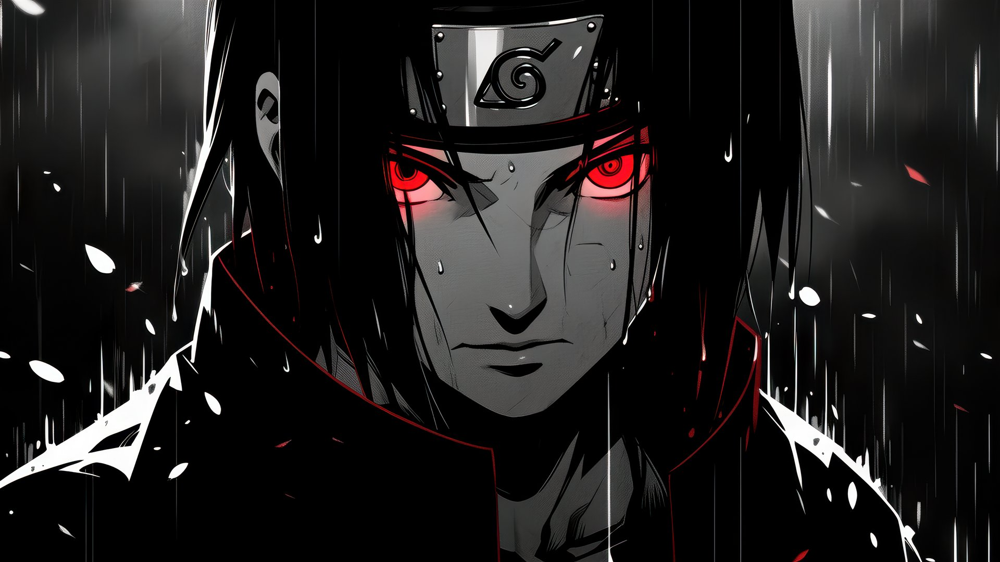

# うちはイタチ — UCHIHA ITACHI

An immersive, scroll-driven web experience dedicated to Itachi Uchiha from *Naruto*. Built with vanilla HTML, CSS, and JavaScript — no frameworks, no build step.

## Preview



> 「一人で背負うと決めた。」 — *He chose to carry it alone.*

---

## Features

### 🎬 Act I — Scroll Scrub (71 frames)
A cinematic frame-by-frame animation scrubbed by scroll position. Four narrative phases:
- **静寂** — Silence (frames 1–13)
- **覚醒** — Awakening (frames 14–24)
- **写輪眼** — Sharingan (frames 25–52)
- **烏** — A Thousand Crows (frames 53–71)

Smooth frame interpolation, animated captions, and a crow-feather particle field that reacts to scroll direction/velocity.

### 👁️ Act II — Mangekyō Live Track (51 frames)
Mouse-tracked eyes that follow your cursor. Nine measured gaze positions mapped left-to-right with crossfade interpolation. The pupils never swing back — the lookup table ensures monotonic left→right travel.

### ⛩️ Act III — Jutsu Grid + Ghost Cursor
Four forbidden arts cards with scroll-driven parallax reveal. A port of [react-bits.dev Ghost Cursor](https://reactbits.dev/animations/ghost-cursor) to raw WebGL (fbm smoke, trail ring-buffer, additive blending). Hover a card to burn away the darkness and reveal the storm beneath.

### 🔥 Amaterasu — Black Flame Hem
Procedural black flames burning at the viewport bottom. Each tongue drawn as a dual-pass: hot additive halo → pure black core. The surviving rim is the "burning edge." Embers drift upward. Pauses automatically for `prefers-reduced-motion`.

### ⛈️ Storm & Synthesized Thunder
Procedural lightning with recursive jagged bolts + forks. Thunder generated entirely in the Web Audio API (brown noise crack + lowpass rolloff + sub-bass rumble) — zero audio files. Toggleable via the header sound button (requires user gesture).

### 🎨 Ambient Layers
- Film grain (SVG turbulence, CSS steps animation)
- Vignette
- Custom difference-blend cursor with hot-state expansion
- Side rails with vertical Japanese text

---

## Quick Start

```bash
# Just open index.html in a browser
# Or serve locally (recommended for frame loading):
npx serve .
# or
python -m http.server 8000
```

> **Note:** Frames load asynchronously on first visit (~122 images). The preloader shows progress. Subsequent visits use browser cache.

---

## Project Structure

```
Itachi/
├── index.html          # Semantic markup, all sections
├── main.js             # ~980 lines — all logic (single file)
├── style.css           # ~620 lines — all styling (single file)
├── frames/
│   ├── storm.jpg       # Background plate for Jutsu reveal
│   ├── main/           # 71 frames (001–071.jpg) — Act I
│   └── eyes/           # 51 frames (001–051.jpg) — Act II
└── README.md
```

---

## Technical Highlights

| Area | Approach |
|------|----------|
| **Frame rendering** | `drawImage` with cover-fit helper that preserves composition on any aspect ratio |
| **Smooth scrub** | Lerp toward scroll target (0.14 easing) — buttery both directions |
| **Gaze tracking** | Monotonic LUT (9 measured centroids) → crossfade between nearest frames |
| **Ghost cursor** | Raw WebGL port: fbm smoke, 28-segment trail ring buffer, additive blend |
| **Amaterasu** | 9-blob stack per tongue, dual-pass (halo → black body), depth-sorted |
| **Thunder** | Runtime AudioContext: brown noise + biquad filters + sine sub-bass |
| **Parallax** | `data-px` speed per element, `easeOutCubic` entry, continuous drift after fade |
| **Performance** | DPR capped at 2×, ghost canvas budget ~420k pixels, `requestAnimationFrame` loop |
| **Accessibility** | `prefers-reduced-motion` respected (disables animations, paints static frames) |

---

## Browser Support

- Modern browsers with WebGL2 / WebGL1 + OES_standard_derivatives
- Chrome 90+, Firefox 88+, Safari 15+, Edge 90+
- Mobile: iOS Safari 15+, Chrome for Android 90+

---

## Credits

- **Character**: Itachi Uchiha — *Naruto* by Masashi Kishimoto / Studio Pierrot
- **Ghost Cursor algorithm**: [react-bits.dev](https://reactbits.dev/animations/ghost-cursor) (three.js → raw WebGL port)
- **Fonts**: Shippori Mincho, Zen Kaku Gothic New, Cinzel, Space Grotesk (Google Fonts)
- **Frame assets**: Custom / sourced from the anime

---

## License

MIT — Free to use, modify, and share. Attribution appreciated.

> 「命を賭して、里を守る。」  
> *To protect the village, he gave up being loved by it.*